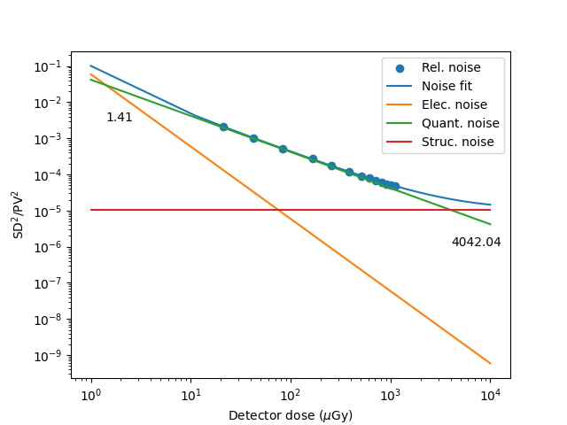

# Mammography Noise Analysis

This script analyzes mammography noise characteristics as a function of detector dose. The input data is measured dose (uGy), mean pixel value and pixel value standard deviation. An example measurement values file is provided.